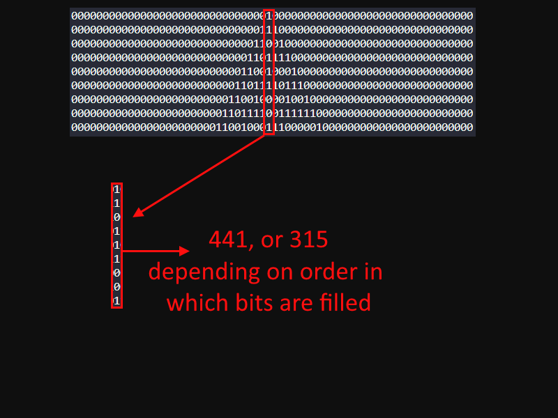
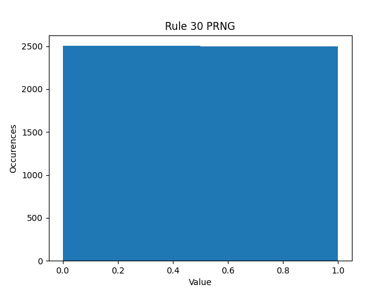
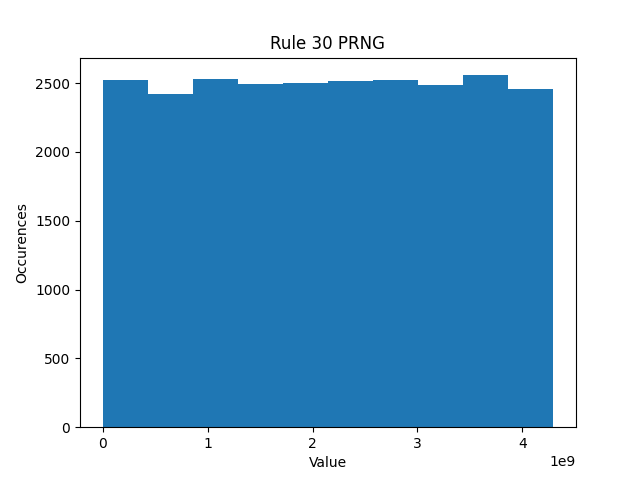
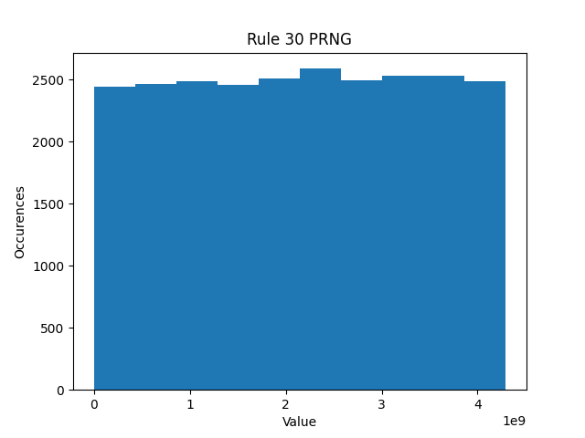
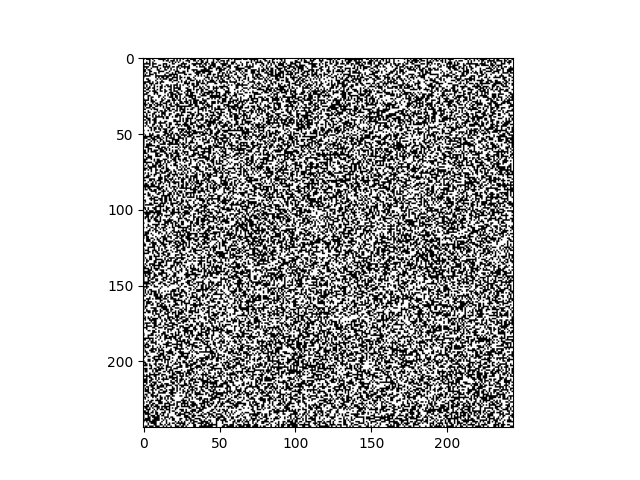
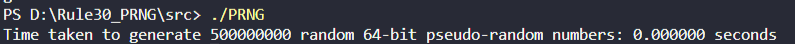

# Rule-30 as a PRNG

Using Rule-30 as a Pseudo-random number generator

## Objective
Create a PRNG with good statistical properties and a very small state 

## Goals
- Demonstrate good randomness
- be as fast as possible
- have a very small state size 

## Idea
The idea is to use the center cell as a stream of bits. The procedure for generating
a pseudo-random N-bit word is then very simple; starting from some initial state S0
the automata is evolved N times, at iteration i the N-bit word's ith bit is determined by the center cell in the current state.
It is possible to generate the N-bit word by opting to instead determine the word's N-ith bit as the center cell to fill the most significant bits first. Wether one fills the word with bits from left to right, or right to left, seems to have no impact on the uniformity of the outputs.

# Analysis
## Uniformity

The Rule-30 PRNG displays very good uniformity in its outputs

### Generating a 0 or 1

### Generating 32 bit numbers

### Generating 64 bit numbers

### Generated 244x244 Bitmap

## Space 
The automata uses only 64 bits to encode its state. This is in comparison to other PRNGs such as 
the Mersenne Twister, which may use 20480 bits (2.5 Kib as per [Wikipedia](https://en.wikipedia.org/wiki/Mersenne_Twister)).
With a state of 64 bits it even beats the TinyMT variant which has a 127 bit state.

## Speed
The automata can generate N-bit words with incredible speed. Using inline functions one can get absurdly long sequences in no time. On my machine it is able to generate a sequence of 500,000,000 64 bit pseudo-random numbers in 0 seconds.

