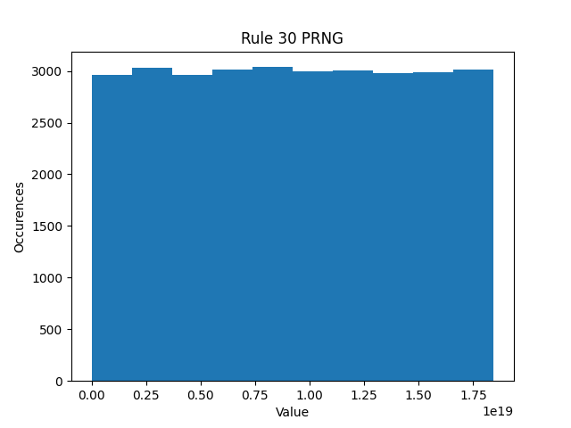

# Rule-30 as a PRNG
Using Rule-30 as a Pseudo-random number generator

## Objective
Create a PRNG with good statistical properties and a very small state 

## Goals
- Demonstrate good randomness
- be as fast as possible
- have a very small state size 

# Analysis
## Uniformity

The Rule-30 PRNG displays very good uniformity in its outputs

### Generating a 0 or 1

### Generating 32 bit numbers

### Generating 64 bit numbers

### Generated 244x244 Bitmap

## Space 
The automata uses only 64 bits to encode its state. This is in comparison to other PRNGs such as 
the Mersenne Twister, which may use 20480 bits (2.5 Kib as per [Wikipedia](https://en.wikipedia.org/wiki/Mersenne_Twister))

